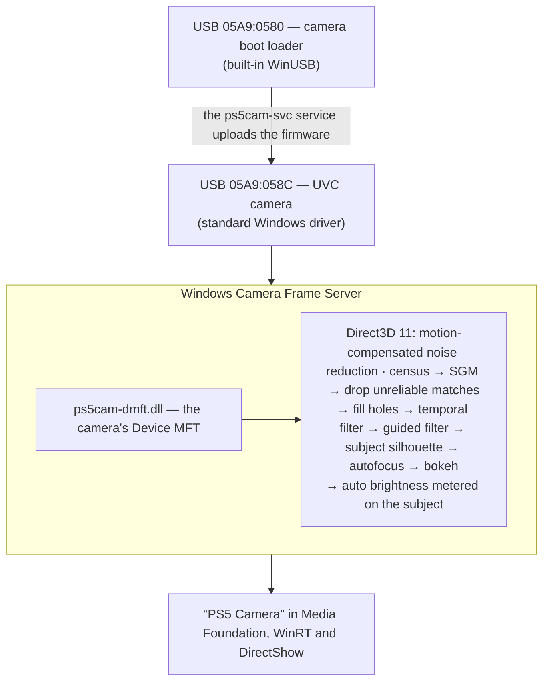

<div align="center">

# PS5 HD Camera for PC

**The PlayStation 5 camera as a regular webcam: Full HD at 60 fps and bokeh from real depth**

[](https://github.com/KROU4/PS5CameraDriver/actions/workflows/build.yml)
[](https://github.com/KROU4/PS5CameraDriver/releases/latest)
[](LICENSE)

-FCC624?logo=linux&logoColor=black)


**English** · [Русский](README.ru.md)

[Download](https://github.com/KROU4/PS5CameraDriver/releases/latest) · [Install](#install) · [Performance](#performance) · [How it works](#how-it-works-windows) · [Code signing policy](#code-signing-policy)

</div>

A driver for the PlayStation 5 HD Camera (CFI-ZEY1). The camera works in Zoom, Discord, Teams,
Telegram, OBS, browsers and any other program.

- **Windows 11:** native 1920x1080 at 60 fps in every program (optionally also 720p and 30 fps)
  and **bokeh**: the background is blurred by real depth measured with the camera's two sensors,
  just like on the PS5. No neural networks: the GPU computes depth with a stereo algorithm
  (census + SGM) in Direct3D 11 shaders. The camera shows up as "PS5 Camera", with no separate
  virtual camera, and the bokeh is switched like Windows' own camera effects: Settings →
  Cameras → Background effects (standard or portrait blur). The whole head stays sharp
  (ears, hair, headphones), the exposure follows the person, not the window behind them, and
  motion-compensated noise reduction and automatic anti-flicker help in dim rooms.
- **Linux:** native 1920x1080 at 30 and 60 fps, and (experimental, x86_64) the same bokeh computed
  on the GPU through Vulkan: a daemon reads the camera and feeds a v4l2loopback camera "PS5 Camera".
- **macOS:** the camera without bokeh, native 1920x1080 at 30 and 60 fps.

## Install

A **USB 3** port is required: on USB 2.0 the camera only delivers 640x400.

**Windows 11**
1. Download `PS5CameraDriver.msi` (`PS5CameraDriver-ru.msi` in Russian) from the
   [releases](https://github.com/KROU4/PS5CameraDriver/releases/latest) page and run it, or
   `winget install KROU4.PS5CameraDriver` once the package is in winget. It needs administrator
   rights and, at installation or later, an internet connection (it downloads Sony's original
   firmware, see [Firmware](#firmware)). Until releases are digitally signed, SmartScreen may warn
   about an unknown publisher (see [Code signing policy](#code-signing-policy)).
2. Choose the "PS5 Camera" camera in your programs.

Bokeh is on after the first installation. Switch it in Settings → Bluetooth & devices → Cameras →
PS5 Camera → Camera effects. Unattended installation:
`msiexec /i PS5CameraDriver.msi /qn BOKEH=on|off`. The ZIP package (`Install.cmd`) installs the
same without MSI. Details, modes, settings and troubleshooting:
[installer/README.txt](installer/README.txt).

**Linux** (systemd and udev required): `sudo bash install.sh` from `PS5CameraDriver-linux.zip`;
`--bokeh on` adds the bokeh (x86_64, a GPU with Vulkan 1.1, v4l2loopback, which the installer
installs), `--bokeh off` the plain camera. Details: [installer/linux/README.txt](installer/linux/README.txt).

**macOS** (Command Line Tools required: `xcode-select --install`): `sudo bash install.sh` from
`PS5CameraDriver-macos.zip`.

Uninstall: Settings → Apps → Installed apps on Windows; `uninstall.sh` from the install folder on
Linux and macOS (the installer prints its path at the end).

## Performance

The picture is computed on the graphics card, so the driver needs one that supports Direct3D 11
(Windows) or Vulkan 1.1 (Linux); integrated graphics count. Measured on an RTX 3060 Ti with a
Ryzen 5 5600, 1920x1080 at 60 fps:

| Mode | GPU time per frame | GPU busy at 60 fps | GPU memory | CPU (driver) |
|---|---|---|---|---|
| Camera without effects | 2.6–2.9 ms | ~17% | ~60 MB | ~9% of one core |
| Bokeh | 8.6–9.0 ms | ~53% | ~100–130 MB | ~12% of one core |
| Bokeh, 1280x720 output | 8.1 ms | ~49% | ~120 MB | — |
| Bokeh and the depth camera | 9.9 ms | ~59% | ~160 MB | — |

The GPU time and CPU of the first two rows come from the live camera (`ps5cam-ctl status` shows
the GPU time per frame while a program uses the camera; the CPU is Windows Camera Frame Server's,
where the effect runs), the rest from recorded camera frames fed at 60 fps. The Vulkan version
(Linux) takes about the same: 3.0 ms without effects, 9.2 ms with bokeh on the same card. Without a
graphics card (Windows' software renderer on the 6-core CPU) a frame takes 165 ms without effects
and 550 ms with bokeh, so a GPU is required.

The work per frame is the same on any card, so the time grows as the card gets slower: for bokeh at
60 fps a card needs to be roughly at least 60% as fast as an RTX 3060 Ti; at 30 fps (choose 30 fps in
the program, see [installer/README.txt](installer/README.txt)) about a quarter. Integrated graphics
will most likely manage bokeh only at 30 fps or the camera without effects — this is an estimate, not
a measurement. If you try it on other hardware, please share the frame rate and GPU time from
`ps5cam-ctl status` in [Discussions](https://github.com/KROU4/PS5CameraDriver/discussions).

## Firmware

The camera needs firmware every time it is plugged in; the driver's service uploads it. Sony's
firmware is not part of the project: the installer downloads the original image (PS5 system
software 21.01-03.20.00.04) from public copies, checks its SHA-256 and applies the driver's
changes — 90 bytes from [firmware/ps5cam-firmware.json](firmware/ps5cam-firmware.json). On
Windows an installation without internet access still completes, and the service builds the
firmware when the camera is plugged in and the computer is online. Offline, put the original next to
the installer as `sony-firmware.bin` or pass it with `SONYFIRMWARE=` (MSI), `-Original`
(`Install.cmd`) or `--original` (Linux, macOS).

What the patch changes:
- 1920x1080 from one sensor at 60 fps (Sony limits 1080p to 30 fps);
- a 1080p60 bokeh mode: the full frame of the main sensor plus a 960x540 copy of the second one,
  downscaled in hardware by the camera's bridge chip. Two full 1080p60 streams do not fit the
  camera's USB bandwidth (about 393 MB/s available, 498 needed); this mode takes about 320 MB/s;
- automatic exposure by default.

## How it works (Windows)



A Device MFT is the standard Windows way to add frame processing to a camera: the code runs in
user mode inside Frame Server, so no kernel driver and no driver signature are needed. The
previous variant with a separate virtual camera is still available: `Install.cmd -VirtualCamera`.

| Component | Purpose |
|---|---|
| [src/service](src/service) | service: uploads the firmware, attaches the effect to the camera on every plug-in |
| [src/dmft](src/dmft) | Device MFT: the effect inside the camera |
| [src/vcam](src/vcam) | virtual camera (`-VirtualCamera` variant) |
| [src/core](src/core) | GPU pipeline on Direct3D 11 (Windows) or Vulkan (Linux), shaders in [src/core/shaders](src/core/shaders) |
| [src/linux](src/linux) | `ps5cam-bokehd`: bokeh on Linux (V4L2 capture → Vulkan → v4l2loopback) |
| [src/ctl](src/ctl) | `ps5cam-ctl`: settings (`set mode 0` — bokeh, `set mode 1` — none), registration |
| [src/tray](src/tray) | tray icon for development (`Install.cmd -Tray`) |
| [installer](installer) | installers: MSI ([installer/msi](installer/msi)) and ZIP for Windows, Linux, macOS; winget manifests ([installer/winget](installer/winget)) |

**Boot-mode driver.** It is Windows' built-in WinUSB; there is no own kernel code. Windows only
accepts a driver package that is signed, so the installer creates a certificate on this computer,
signs the package catalog with it, adds the certificate to the trusted stores and deletes the
private key right away: nothing else can ever be signed with it. Test mode is not needed.
Uninstalling the driver removes the certificate too.

## Building from source

Requires Windows 11, Visual Studio 2022 Build Tools (C++) and Windows SDK 10.0.26100.

```powershell
.\build.ps1      # build\Release
.\package.ps1    # dist\: packages for Windows (ZIP, and MSI with WiX), Linux and macOS
```

The MSI packages need the WiX Toolset 5 .NET tool: `dotnet tool install --global wix --version 5.0.2`.

Linux (the bokeh daemon; Ubuntu 22.04 or newer): CMake 3.25+, Ninja, `libvulkan-dev` and `dxc` from
the [DirectXShaderCompiler releases](https://github.com/microsoft/DirectXShaderCompiler/releases)
(it compiles the same HLSL shaders to SPIR-V):

```bash
cmake -S . -B build -G Ninja -DCMAKE_BUILD_TYPE=Release && cmake --build build
```

[GitHub Actions](.github/workflows/build.yml) builds the same packages on every commit and
publishes them as a release for `v*` tags.

## Limitations

- One program uses the camera at a time, as with any webcam.
- The camera measures depth from about half a metre: anything closer is blurred unevenly.
- Bokeh on Linux is experimental: the Vulkan pipeline gives the same picture as Windows on the
  same GPU (checked frame by frame), but it has seen little use with the camera on Linux yet.
- No bokeh on macOS: it would need a camera system extension, which macOS only runs with an Apple
  developer signature.

## Contributing

Bug reports and ideas go to [Issues](https://github.com/KROU4/PS5CameraDriver/issues), questions to
[Discussions](https://github.com/KROU4/PS5CameraDriver/discussions); pull request rules are in
[CONTRIBUTING.md](CONTRIBUTING.md), vulnerabilities — see [SECURITY.md](SECURITY.md).

## Code signing policy

Free code signing provided by [SignPath.io](https://about.signpath.io), certificate by
[SignPath Foundation](https://signpath.org).

A signature confirms that the file was built from this repository's source code by an automated
GitHub Actions build. Every release is signed only after manual approval.

- Committers and reviewers: [KROU4](https://github.com/KROU4)
- Approvers: [KROU4](https://github.com/KROU4)

Signed files are the programs and install scripts in `PS5CameraDriver.zip`: `ps5cam-dmft.dll`,
`ps5cam-vcam.dll`, `ps5cam-svc.exe`, `ps5cam-ctl.exe`, `ps5cam-tray.exe`, `install.ps1`,
`uninstall.ps1`, `firmware.ps1`; the MSI packages are built from these signed files.

**Privacy policy.** This program will not transfer any information to other networked systems
unless specifically requested by the user or the person installing or operating it. The only
network access is the installer downloading Sony's original firmware from the addresses in
[firmware/ps5cam-firmware.json](firmware/ps5cam-firmware.json) (copies on GitHub) when it is not
placed next to the installer. Camera video is processed on this computer only.

## License

The code is licensed under the [GNU GPL 3.0](LICENSE): you may use it freely, including at work,
study, modify and redistribute it; software built on it must also be open source under GPL-3.0.

The camera firmware belongs to Sony and is not part of the project. The polynomial approximation of
the Turbo colormap in the debug depth view is © Google LLC, Apache License 2.0.
