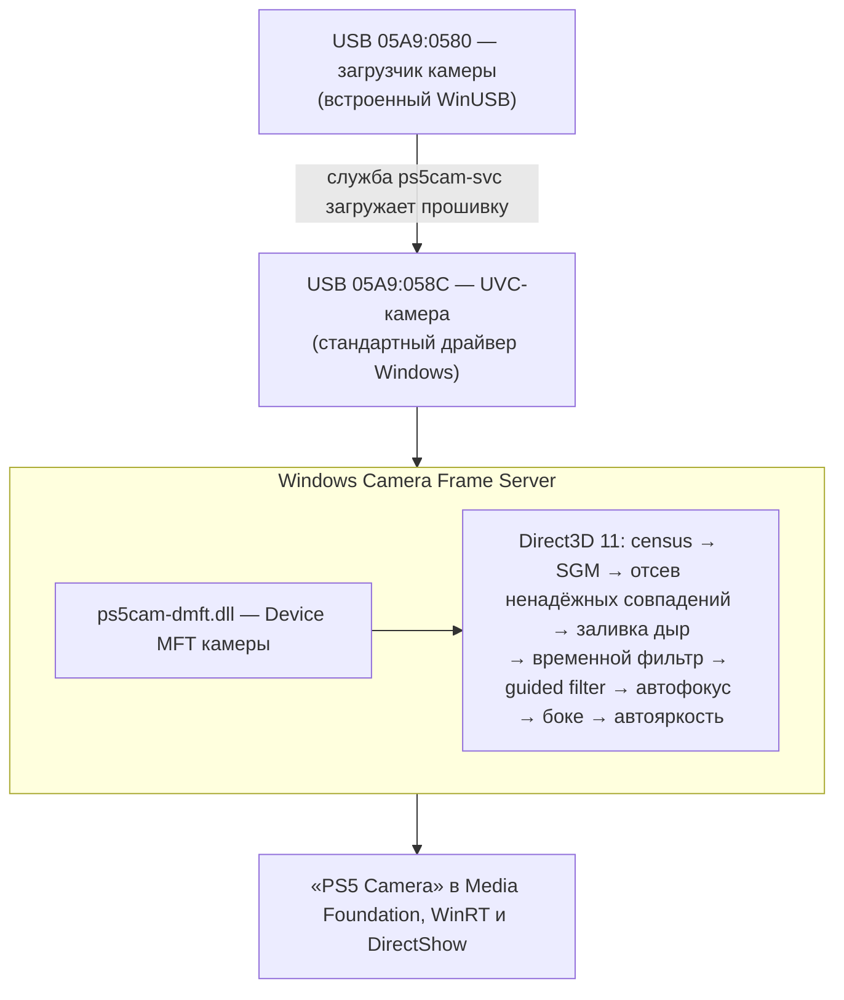

<div align="center">

# PS5 HD Camera для ПК

**Камера PlayStation 5 как обычная веб-камера: Full HD 60 к/с и боке по настоящей глубине**

[](https://github.com/KROU4/PS5CameraDriver/actions/workflows/build.yml)
[](https://github.com/KROU4/PS5CameraDriver/releases/latest)
[](LICENSE)


[English](README.md) · **Русский**

[Скачать](https://github.com/KROU4/PS5CameraDriver/releases/latest) · [Установка](#установка) · [Как это устроено](#как-это-устроено-windows) · [Code signing policy](#code-signing-policy)

</div>

Драйвер для камеры PlayStation 5 HD Camera (CFI-ZEY1). Камера работает в Zoom, Discord, Teams,
Telegram, OBS, браузерах и любых других программах.

- **Windows 11:** родные 1920x1080 при 60 к/с во всех программах (по желанию также 720p и 30 к/с)
  и **боке**: фон размывается по настоящей глубине, которую считают два сенсора камеры, как на
  PS5. Нейросети не используются: глубину считает видеокарта стерео-алгоритмом (census + SGM) в
  шейдерах Direct3D 11. Камера видна в системе как «PS5 Camera», без отдельной виртуальной камеры.
- **Linux и macOS:** камера без боке, родные 1920x1080 при 30 и 60 к/с.

## Установка

Нужен порт **USB 3**: в USB 2.0 камера отдаёт только 640x400.

**Windows 11**
1. Скачайте `PS5CameraDriver.zip` со страницы [релизов](https://github.com/KROU4/PS5CameraDriver/releases/latest).
2. Если Windows предупреждает о файлах из интернета, перед распаковкой откройте свойства архива и
   отметьте «Разблокировать» (пока релиз без цифровой подписи, см. [Code signing policy](#code-signing-policy)).
3. Распакуйте и запустите `Install.cmd`. Установщик спросит, нужно ли боке (сразу задать:
   `Install.cmd -Bokeh on` или `-Bokeh off`), перечислит, что изменит в системе, и попросит права
   администратора.
4. В программах выберите камеру «PS5 Camera».

Сменить режим потом: запустите установщик ещё раз. Подробности, режимы и решение проблем — в
[installer/README.ru.txt](installer/README.ru.txt).

**Linux** (нужны systemd и udev): `sudo bash install.sh` из `PS5CameraDriver-linux.zip`.

**macOS** (нужны Command Line Tools: `xcode-select --install`): `sudo bash install.sh` из
`PS5CameraDriver-macos.zip`.

Удаление: `Uninstall.cmd` или «Параметры → Приложения» на Windows, `uninstall.sh` из папки
установки на Linux и macOS (путь установщик печатает в конце).

## Прошивка

Камере при каждом подключении нужна прошивка, её загружает служба драйвера. Прошивка Sony в
проект не входит: установщик скачивает оригинальный образ (PS5 system software 21.01-03.20.00.04)
из публичных копий, проверяет его SHA-256 и накладывает изменения драйвера —
90 байт из [firmware/ps5cam-firmware.json](firmware/ps5cam-firmware.json). Без интернета положите
оригинал рядом с установщиком под именем `sony-firmware.bin` или укажите его параметром
`-Original` (Windows) / `--original` (Linux, macOS).

Что меняет патч:
- 1920x1080 с одного сенсора при 60 к/с (у Sony 1080p ограничен 30 к/с);
- режим для боке 1080p60: полный кадр главного сенсора и копия второго в 960x540, которую
  аппаратно уменьшает мост камеры. Два полных 1080p60 не помещаются в USB-канал камеры
  (около 393 МБ/с при нужных 498), а этот режим занимает около 320 МБ/с;
- автоэкспозиция по умолчанию.

## Как это устроено (Windows)



Device MFT — штатный способ Windows добавить обработку кадров в камеру: код работает в
пользовательском режиме внутри Frame Server, драйвер ядра и его подпись не нужны. Прежний
вариант с отдельной виртуальной камерой остался: `Install.cmd -VirtualCamera`.

| Компонент | Назначение |
|---|---|
| [src/service](src/service) | служба: загрузка прошивки, подключение эффекта к камере при каждом подключении |
| [src/dmft](src/dmft) | Device MFT: эффект внутри камеры |
| [src/vcam](src/vcam) | виртуальная камера (вариант `-VirtualCamera`) |
| [src/core](src/core) | конвейер на видеокарте, шейдеры в [src/core/shaders](src/core/shaders) |
| [src/ctl](src/ctl) | `ps5cam-ctl`: настройки (`set mode 0` — боке, `set mode 1` — без), регистрация |
| [src/tray](src/tray) | значок в трее для разработки (`Install.cmd -Tray`) |
| [installer](installer) | установщики для Windows, Linux и macOS |

**Драйвер режима загрузчика.** Это встроенный в Windows WinUSB, своего кода в ядре нет. Windows
принимает пакет драйвера только с подписью. Поэтому установщик создаёт сертификат на этом
компьютере, подписывает им каталог пакета, добавляет сертификат в доверенные и сразу удаляет
закрытый ключ: подписать им что-то ещё уже невозможно. Тестовый режим Windows не нужен.
Удаление драйвера убирает и сертификат.

## Сборка из исходников

Нужны Windows 11, Visual Studio 2022 Build Tools (C++) и Windows SDK 10.0.26100.

```powershell
.\build.ps1      # build\Release
.\package.ps1    # dist\: пакеты для Windows, Linux и macOS
```

Те же пакеты собирает [GitHub Actions](.github/workflows/build.yml) на каждый коммит; на тег `v*`
они выкладываются в релиз.

## Ограничения

- Камерой одновременно пользуется одно приложение, как и обычной веб-камерой.
- Глубину камера различает примерно с полуметра: то, что ближе, размывается неровно.
- Боке есть только на Windows. На macOS для него нужна системная камера-расширение, которую
  macOS запускает только с подписью разработчика Apple.

## Участие

Сообщения об ошибках и идеи — в [Issues](https://github.com/KROU4/PS5CameraDriver/issues), вопросы —
в [Discussions](https://github.com/KROU4/PS5CameraDriver/discussions) (можно по-русски), правила для
pull request — в [CONTRIBUTING.md](CONTRIBUTING.md), об уязвимостях — [SECURITY.md](SECURITY.md).

## Code signing policy

Free code signing provided by [SignPath.io](https://about.signpath.io), certificate by
[SignPath Foundation](https://signpath.org).

Подпись подтверждает, что файл собран из исходного кода этого репозитория автоматической сборкой
GitHub Actions. Каждый релиз подписывается только после ручного одобрения.

- Committers and reviewers (авторы и проверяющие): [KROU4](https://github.com/KROU4)
- Approvers (одобряют подпись релиза): [KROU4](https://github.com/KROU4)

Подписываются программы и сценарии установки из `PS5CameraDriver.zip`: `ps5cam-dmft.dll`,
`ps5cam-vcam.dll`, `ps5cam-svc.exe`, `ps5cam-ctl.exe`, `ps5cam-tray.exe`, `install.ps1`,
`uninstall.ps1`.

**Privacy policy.** This program will not transfer any information to other networked systems
unless specifically requested by the user or the person installing or operating it. Программа не
передаёт никаких данных по сети. Единственное сетевое обращение — установщик скачивает
оригинальную прошивку Sony с адресов из [firmware/ps5cam-firmware.json](firmware/ps5cam-firmware.json)
(копии на GitHub), если её не положили рядом с установщиком. Видео с камеры обрабатывается только
на этом компьютере.

## Лицензия

Код распространяется под [GNU GPL 3.0](LICENSE): им можно свободно пользоваться, в том числе в
работе, изучать, менять и распространять; программы на его основе тоже должны быть открыты под
GPL-3.0.

Прошивка камеры принадлежит Sony и в проект не входит. Полиномиальное приближение палитры Turbo
в отладочном виде карты глубины — © Google LLC, Apache License 2.0.
