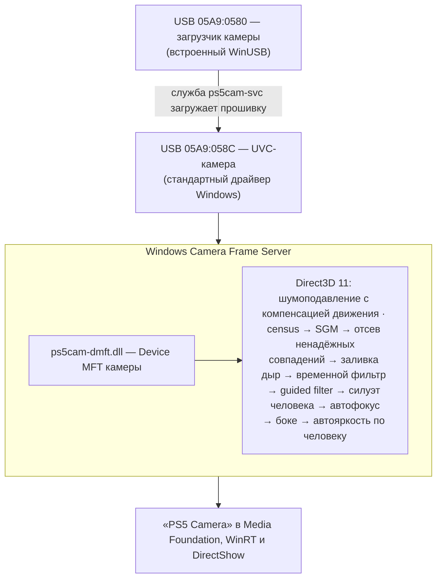

<div align="center">

# PS5 HD Camera для ПК

**Камера PlayStation 5 как обычная веб-камера: Full HD 60 к/с и боке по настоящей глубине**

[](https://github.com/KROU4/PS5CameraDriver/actions/workflows/build.yml)
[](https://github.com/KROU4/PS5CameraDriver/releases/latest)
[](LICENSE)


[English](README.md) · **Русский**

[Скачать](https://github.com/KROU4/PS5CameraDriver/releases/latest) · [Установка](#установка) · [Производительность](#производительность) · [Как это устроено](#как-это-устроено-windows) · [Code signing policy](#code-signing-policy)

</div>

Драйвер для камеры PlayStation 5 HD Camera (CFI-ZEY1). Камера работает в Zoom, Discord, Teams,
Telegram, OBS, браузерах и любых других программах.

- **Windows 11:** родные 1920x1080 при 60 к/с во всех программах (по желанию также 720p и 30 к/с)
  и **боке**: фон размывается по настоящей глубине, которую считают два сенсора камеры, как на
  PS5. Нейросети не используются: глубину считает видеокарта стерео-алгоритмом (census + SGM) в
  шейдерах Direct3D 11. Камера видна в системе как «PS5 Camera», без отдельной виртуальной камеры,
  а боке включается как собственные эффекты камеры Windows: Параметры → Камеры → Эффекты фона
  (стандартное или портретное размытие). Голова остаётся резкой целиком (уши, волосы, наушники),
  экспозиция подстраивается под человека, а не под окно за ним, а в тёмной комнате помогают
  шумоподавление с компенсацией движения и автоматическая защита от мерцания ламп.
- **Linux:** родные 1920x1080 при 30 и 60 к/с, а также (экспериментально, x86_64) то же боке, которое
  считает видеокарта через Vulkan: служба читает камеру и отдаёт картинку в камеру v4l2loopback
  «PS5 Camera».
- **macOS:** камера без боке, родные 1920x1080 при 30 и 60 к/с.

## Установка

Нужен порт **USB 3**: в USB 2.0 камера отдаёт только 640x400.

**Windows 11**
1. Скачайте `PS5CameraDriver-ru.msi` (на английском — `PS5CameraDriver.msi`) со страницы
   [релизов](https://github.com/KROU4/PS5CameraDriver/releases/latest) и запустите, либо
   `winget install KROU4.PS5CameraDriver`, когда пакет появится в winget. Нужны права администратора
   и — при установке или позже — интернет (скачивается оригинальная прошивка Sony, см.
   [Прошивка](#прошивка)). Пока релизы без цифровой подписи, SmartScreen может предупредить о
   неизвестном издателе (см. [Code signing policy](#code-signing-policy)).
2. В программах выберите камеру «PS5 Camera».

После первой установки боке включено. Переключается в Параметры → Bluetooth и устройства →
Камеры → PS5 Camera → Эффекты камеры. Установка без окон:
`msiexec /i PS5CameraDriver-ru.msi /qn BOKEH=on|off`. ZIP-пакет (`Install.cmd`) ставит то же без
MSI. Подробности, режимы, настройки и решение проблем — в
[installer/README.ru.txt](installer/README.ru.txt).

**Linux** (нужны systemd и udev): `sudo bash install.sh` из `PS5CameraDriver-linux.zip`;
`--bokeh on` добавляет боке (x86_64, видеокарта с Vulkan 1.1, v4l2loopback — его установщик поставит
сам), `--bokeh off` — обычная камера. Подробности — в [installer/linux/README.ru.txt](installer/linux/README.ru.txt).

**macOS** (нужны Command Line Tools: `xcode-select --install`): `sudo bash install.sh` из
`PS5CameraDriver-macos.zip`.

Удаление: «Параметры → Приложения → Установленные приложения» на Windows, `uninstall.sh` из папки
установки на Linux и macOS (путь установщик печатает в конце).

## Производительность

Картинку считает видеокарта, поэтому драйверу нужна видеокарта с Direct3D 11 (Windows) или Vulkan 1.1
(Linux); встроенная графика тоже подходит. Замеры на RTX 3060 Ti и Ryzen 5 5600, 1920x1080 при 60 к/с:

| Режим | Время видеокарты на кадр | Занятость видеокарты при 60 к/с | Память видеокарты | Процессор (драйвер) |
|---|---|---|---|---|
| Камера без эффектов | 2,6–2,9 мс | ~17% | ~60 МБ | ~9% одного ядра |
| Боке | 8,6–9,0 мс | ~53% | ~100–130 МБ | ~12% одного ядра |
| Боке, выход 1280x720 | 8,1 мс | ~49% | ~120 МБ | — |
| Боке и камера глубины | 9,9 мс | ~59% | ~160 МБ | — |

Время видеокарты и процессор в первых двух строках сняты с живой камеры (`ps5cam-ctl status`
показывает время видеокарты на кадр, пока камерой пользуется программа; процессор — это Windows
Camera Frame Server, где работает эффект), остальное — на записанных кадрах камеры, поданных с
частотой 60 к/с. Версия на Vulkan (Linux) требует примерно столько же: 3,0 мс без эффектов и 9,2 мс
с боке на той же карте. Без видеокарты (программный рендер Windows на 6-ядерном процессоре) кадр
считается 165 мс без эффектов и 550 мс с боке, так что видеокарта обязательна.

Работа на кадр одинакова на любой карте, поэтому время растёт с её медлительностью: для боке при
60 к/с нужна карта примерно не слабее 60% RTX 3060 Ti, при 30 к/с (выберите 30 к/с в программе, см.
[installer/README.ru.txt](installer/README.ru.txt)) — около четверти. Встроенная графика, скорее
всего, потянет боке только при 30 к/с или камеру без эффектов — это оценка, а не замер. Если
попробуете на другом железе, поделитесь частотой кадров и временем видеокарты из `ps5cam-ctl status`
в [Discussions](https://github.com/KROU4/PS5CameraDriver/discussions).

## Прошивка

Камере при каждом подключении нужна прошивка, её загружает служба драйвера. Прошивка Sony в
проект не входит: установщик скачивает оригинальный образ (PS5 system software 21.01-03.20.00.04)
из публичных копий, проверяет его SHA-256 и накладывает изменения драйвера —
90 байт из [firmware/ps5cam-firmware.json](firmware/ps5cam-firmware.json). В Windows установка без
интернета всё равно завершается, а служба соберёт прошивку, когда камера будет подключена и
появится интернет. Совсем без интернета положите оригинал рядом с установщиком под именем
`sony-firmware.bin` или укажите его параметром `SONYFIRMWARE=` (MSI), `-Original` (`Install.cmd`)
или `--original` (Linux, macOS).

Что меняет патч:
- 1920x1080 с одного сенсора при 60 к/с (у Sony 1080p ограничен 30 к/с);
- режим для боке 1080p60: полный кадр главного сенсора и копия второго в 960x540, которую
  аппаратно уменьшает мост камеры. Два полных 1080p60 не помещаются в USB-канал камеры
  (около 393 МБ/с при нужных 498), а этот режим занимает около 320 МБ/с;
- автоэкспозиция по умолчанию.

## Как это устроено (Windows)



Device MFT — штатный способ Windows добавить обработку кадров в камеру: код работает в
пользовательском режиме внутри Frame Server, драйвер ядра и его подпись не нужны. Прежний
вариант с отдельной виртуальной камерой остался: `Install.cmd -VirtualCamera`.

| Компонент | Назначение |
|---|---|
| [src/service](src/service) | служба: загрузка прошивки, подключение эффекта к камере при каждом подключении |
| [src/dmft](src/dmft) | Device MFT: эффект внутри камеры |
| [src/vcam](src/vcam) | виртуальная камера (вариант `-VirtualCamera`) |
| [src/core](src/core) | конвейер на видеокарте: Direct3D 11 (Windows) или Vulkan (Linux), шейдеры в [src/core/shaders](src/core/shaders) |
| [src/linux](src/linux) | `ps5cam-bokehd`: боке на Linux (захват V4L2 → Vulkan → v4l2loopback) |
| [src/ctl](src/ctl) | `ps5cam-ctl`: настройки (`set mode 0` — боке, `set mode 1` — без), регистрация |
| [src/tray](src/tray) | значок в трее для разработки (`Install.cmd -Tray`) |
| [installer](installer) | установщики: MSI ([installer/msi](installer/msi)) и ZIP для Windows, Linux, macOS; манифесты winget ([installer/winget](installer/winget)) |

**Драйвер режима загрузчика.** Это встроенный в Windows WinUSB, своего кода в ядре нет. Windows
принимает пакет драйвера только с подписью. Поэтому установщик создаёт сертификат на этом
компьютере, подписывает им каталог пакета, добавляет сертификат в доверенные и сразу удаляет
закрытый ключ: подписать им что-то ещё уже невозможно. Тестовый режим Windows не нужен.
Удаление драйвера убирает и сертификат.

## Сборка из исходников

Нужны Windows 11, Visual Studio 2022 Build Tools (C++) и Windows SDK 10.0.26100.

```powershell
.\build.ps1      # build\Release
.\package.ps1    # dist\: пакеты для Windows (ZIP, а с WiX и MSI), Linux и macOS
```

Для MSI нужен .NET-инструмент WiX Toolset 5: `dotnet tool install --global wix --version 5.0.2`.

Linux (служба боке; Ubuntu 22.04 и новее): CMake 3.25+, Ninja, `libvulkan-dev` и `dxc` из
[выпусков DirectXShaderCompiler](https://github.com/microsoft/DirectXShaderCompiler/releases) (он
компилирует те же HLSL-шейдеры в SPIR-V):

```bash
cmake -S . -B build -G Ninja -DCMAKE_BUILD_TYPE=Release && cmake --build build
```

Те же пакеты собирает [GitHub Actions](.github/workflows/build.yml) на каждый коммит; на тег `v*`
они выкладываются в релиз.

## Ограничения

- Камерой одновременно пользуется одно приложение, как и обычной веб-камерой.
- Глубину камера различает примерно с полуметра: то, что ближе, размывается неровно.
- Боке на Linux экспериментальное: конвейер на Vulkan даёт ту же картинку, что и на Windows на той же
  видеокарте (проверено покадрово), но с камерой на Linux его пока почти не испытывали.
- На macOS боке нет: для него нужна системная камера-расширение, которую macOS запускает только с
  подписью разработчика Apple.

## Участие

Сообщения об ошибках и идеи — в [Issues](https://github.com/KROU4/PS5CameraDriver/issues), вопросы —
в [Discussions](https://github.com/KROU4/PS5CameraDriver/discussions) (можно по-русски), правила для
pull request — в [CONTRIBUTING.md](CONTRIBUTING.md), об уязвимостях — [SECURITY.md](SECURITY.md).

## Code signing policy

Free code signing provided by [SignPath.io](https://about.signpath.io), certificate by
[SignPath Foundation](https://signpath.org).

Подпись подтверждает, что файл собран из исходного кода этого репозитория автоматической сборкой
GitHub Actions. Каждый релиз подписывается только после ручного одобрения.

- Committers and reviewers (авторы и проверяющие): [KROU4](https://github.com/KROU4)
- Approvers (одобряют подпись релиза): [KROU4](https://github.com/KROU4)

Подписываются программы и сценарии установки из `PS5CameraDriver.zip`: `ps5cam-dmft.dll`,
`ps5cam-vcam.dll`, `ps5cam-svc.exe`, `ps5cam-ctl.exe`, `ps5cam-tray.exe`, `install.ps1`,
`uninstall.ps1`, `firmware.ps1`; пакеты MSI собираются из этих подписанных файлов.

**Privacy policy.** This program will not transfer any information to other networked systems
unless specifically requested by the user or the person installing or operating it. Программа не
передаёт никаких данных по сети. Единственное сетевое обращение — скачивание оригинальной прошивки
Sony с адресов из [firmware/ps5cam-firmware.json](firmware/ps5cam-firmware.json) (копии на GitHub),
если её не положили рядом с установщиком: установщиком, а если ему это не удалось — службой (не
чаще раза в 10 минут, пока камера ждёт прошивку). Кроме этих запросов ничего не отправляется. Видео
с камеры обрабатывается только на этом компьютере.

## Лицензия

Код распространяется под [GNU GPL 3.0](LICENSE): им можно свободно пользоваться, в том числе в
работе, изучать, менять и распространять; программы на его основе тоже должны быть открыты под
GPL-3.0.

Прошивка камеры принадлежит Sony и в проект не входит. Полиномиальное приближение палитры Turbo
в отладочном виде карты глубины — © Google LLC, Apache License 2.0.
